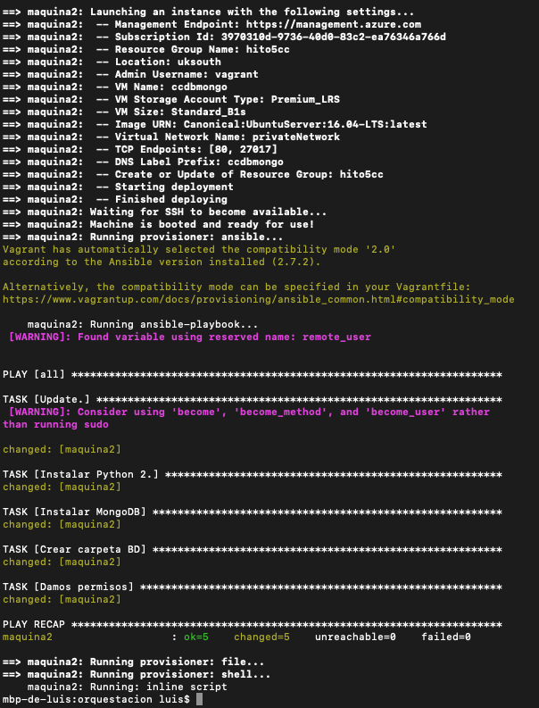
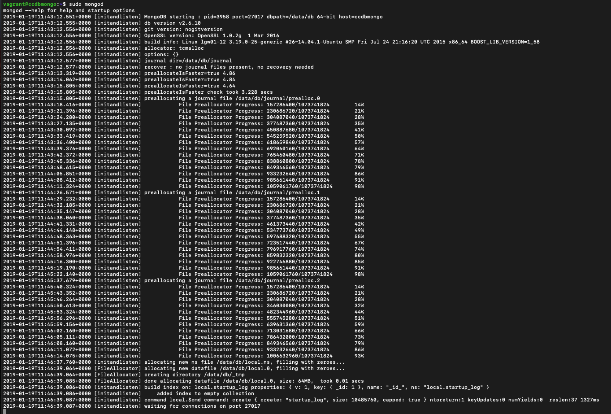

# Orquestación de máquinas virtuales

## Instalación y primeros pasos

Como viene siendo costumbre en la realización de cada avance en el desarrollo y despliegue del proyecto, los primeros pasos se han realizado en el repositorio de ejercicios. En esta ocasión podemos encontrar las instrucciones neceasarias para su instalación y primeros pasos en una máquina anfitriona con sistema operativo Mac OS pinchando [aquí](https://github.com/luiisgallego/MII_CC_EJERCICIOS_1819/tree/master/Tema5).

Una vez que nuestra máquina está correctamente configurada para el uso de Vagrant y su despliegue en máquinas virtuales de Azure, comenzamos la construcción del archivo principal.

## Vagrant

Como ya sabemos, Vagrant es una herramienta que nos permite crear entornos completamente virtualizados. Esto es especialmente útil en conjunto con otras herramientas como es Ansible, ya que nos permite desplegar y provisionar nuestras máquinas virtuales de una manera sencilla. Para ello, es necesario la definición del principal archivo de Vagrant, denominado *Vagrantfile* y que ahora vamos a comentar.

### Vagrantfile

Los primeros pasos que se ha seguido en la definición de tal archivo han sido los especificados en el [github](https://github.com/Azure/vagrant-azure) de Azure-Vagrant. Como en todas las implementaciones de este tipo, se habrá de especificar unas credenciales de configuración con Azure y unos datos para las máquinas virtuales que se requieran.

Como se puede ver en el *Vagrantfile* se han definido dos máquinas virtuales, la primera encargada de proporcionar los recuros y provisión necesarios para el despligue de la aplicación. La segunda será usada para la instalación del servicio de base de datos mongodb. 

La especificación de cada parámetro está perfectamente explicado en el anterior enlace pero vamos a comentar algunos detalles especiales:

- Se ha utilizado la imagen de máquina virtual que mejores resultados nos aportó en los test realizados en el hito anterior, con el mismo tipo de recursos y localización.
- En esta ocasión se han abierto dos puertos necesarios, el 80 para hacer uso de la aplicación y el 27017 para poder hacer uso de la base de datos mongodb. Esto se ha realizado con el parametro "tcp_endpoints".
- Mediante "virtual_network_name" se ha creado una red virtual privada entre las dos máquinas para poder establecer la conexión entre la aplicación y la base de datos mediante IPs privadas.

Es de especial mención los ajustes de configuración que se han en la segunda máquina (mongodb) dentro del *Vagrantfile*. Con ellos se ha buscado tener dicha máquina completamente operativa una vez que accedamos a ella. Para ello en la segunda provisión se ha copiado dentro de la máquina virtual el archivo de configuración necesario, y en la tercera provisión se ha sustituido en la localización correcta. Al tratarse de la carpeta */etc* ha sido necesario permisos de superusuario.

Comentar también que se ha definido un *playbook* específico para la provisión de la máquina con base de datos. En este se ha definido las tareas necesarias para tener *mongodb* disponible en la máquina. Como puede verse, difiere casi al completo del playbook de la aplicación, algo obvio ya que los requisitos de ambas máquinas son totalmente distintos. 

Una vez llegados a este punto ya estamos listos para lanzar el *Vagrantfile*. Como última anotación, hay que lanzarlo con un comando específico para que no se realice la implementación de ambas máquinas en paralelo, lo cual producirá errores. El comando correcto es el siguiente:

~~~
vagrant up --no-parallel
~~~

## Prueba de despliegue

Por último vamos a proporcionar un ejemplo de despligue, provisión y prueba de nuestra aplicación mediante diferentes capturas, a modo de comprobación del correcto funcionamiento.

En las primeras capturas vamos a ver como se ejecuta el *Vagrantfile* y se realiza tanto el despligue como provisión de las dos máquinas virtuales.

Ya hemos levantado ambas máquinas desde nuestra máquina anfitriona y están listas para accerder a ellas mediante *ssh*. Por tanto, primero accedemos a la que contiene la base de datos y ejecutamos el demonio *mongodb* para que esté listo para escuchar peticiones.

Como vemos en la última línea, está listo para escuchar peticiones por el puerto 27017. Arrancamos la máquina con la aplicación y ejectuamos dicha aplicación. 

En estos momentos ya estamos listos para hacer uso al completo de nuestra aplicación. Ahora, desde nuestra máquina anfitriona realizaremos un *put* mediante la ip pública de la máquina que contiene la aplicación. También desde el navegador comprobaremos que nos llega correctamente el *status ok*.

Por último ya solo nos queda por comprobar que tanto en la aplicación como en la base de datos todo está funcionando correctamente, esto podemos hacerlo mediante los logs de ambos, como mostraremos más abajo. Finalmente presentamos una captura de la ejecución de los tests.

## Avance del proyecto

Como avance del proyecto se ha instalado la base de datos *mongodb* localmente en nuestro proyecto, prescindiendo de *mlab*.

Esto nos ha llevado a buscar una imagen de máquina virtual en Azure que contenga mongodb instalado, evitando así tener que realizar una provisión propia para la segunda máquina. Pero nos hemos encontrado que todas las imagenes que hemos localizado eran de pago, por tanto en el proyecto se ha tenido que realizar la provisión en una máquina con sistema operativo *Ubuntu* como anteriormente se ha comentado. 

